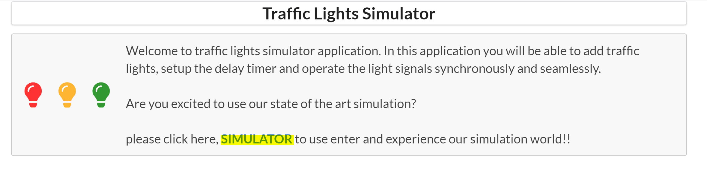

# Instructions to run the simulator

1) Navigate to TrafficLightSimulator Root Folder
2) Create virtual environment by running the command `python -m venv venv`
3) Activate virtual environment by running the command `venv\Scripts\activate`
4) Install Python requirements by running the command `pip install -r requirements.txt`
5) Make Django migrations by running the command `python manage.py makemigrations` followed by `python manage.py migrate`
6) Run the application by running the command `python manage.py runserver 0.0.0.0:8000`
7) After the application server starts to run, open the link `http:localhost:8000` preferably on chrome browser
8) Click on the Simulation link as shown here:

    
9) Enter the number of lights value as 1 and the Go Signal Duration as per the below screen shot.
    
    

_Note:_ Please see, I also provisioned the application to add up to 4 traffic lights which would work in unison in the formation of two groups.